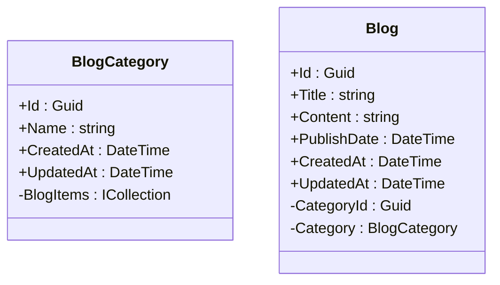

# 建立一個可以連線到資料庫的專案，能夠操作資料的新增、修改、刪除與查詢功能
---
## 目標
- 新增一個 dotnet 專案
- 建立 Blog 類別及以上層 BlogCategory 類別
- 建立 Blog 及 BlogCategory 的Repository
- 建立一個 Blog 及 BlogCategory 的 Controller
- 設定Program.cs完成所需服務宣告
- 設定Appsetting.json，指定資料庫連線字串
---
## 新增 dotnet 專案
- 使用dotnet 新增一個專案，名為blog，使用預設的腳本 webapi。
- 可以使用dotnet new list 查看有什麼腳本。
- 為什麼不用mvc腳本，因為mvc預設會帶Razor，但後面我們會再講解如何新增前端程式angular，所以用純api腳本，如果你要用Razor做畫面，請使用mvc。
- 使用dotnet add package來安裝必要的package或驅動。
```bash
# 新增專案
dotnet new webapi -n blog
cd blog
# 安裝 Swagger (OpenAPI) 支援
dotnet add package Swashbuckle.AspNetCore

# 安裝 Entity Framework Core 核心
dotnet add package Microsoft.EntityFrameworkCore

# 安裝 SQL Lite Server 驅動
dotnet add package Microsoft.EntityFrameworkCore.Sqlite

# 安裝 EF Core 設計時工具 (產生 Migration 與 SQL 腳本必備)
dotnet add package Microsoft.EntityFrameworkCore.Design

# 建立 gitignore 檔案
dotnet new gitignore
```
## 新增 class Blog 跟 BlogCategory , 並加入到AppDbContext中
- BlogCategory跟Blog具有關聯關系，NesCategory提供新聞分類，Blog提供新聞內容。

```csharp
namespace Blackstone.Models;
public class BlogCategory
{
    public Guid Id { get; set; }
    
    // 使用 string.Empty 避免 Nullable 警告
    public string Name { get; set; } = string.Empty;

    public DateTime CreatedAt { get; init; } = DateTime.Now;

    public DateTime UpdatedAt { get; set; } = DateTime.Now;

    // 導覽屬性：一個分類擁有多則新聞
    public virtual ICollection<Blog> BlogItems { get; set; } = new List<Blog>();
}
```
```csharp
namespace Blackstone.Models;
public class Blog
{
    public Guid Id { get; set; }
    
    public string Title { get; set; } = string.Empty;
    
    public string Content { get; set; } = string.Empty;
    
    public DateTime PublishDate { get; set; } = DateTime.Now;

    public DateTime CreatedAt { get; init; } = DateTime.Now;

    public DateTime UpdatedAt { get; set; } = DateTime.Now;

    // 外鍵 (Foreign Key)
    public Guid BlogCategoryId { get; set; }
    
    // 導覽屬性：這則新聞所屬的分類
    public virtual BlogCategory? Category { get; set; }
}
```
```csharp
using Microsoft.EntityFrameworkCore;
using Blackstone.Models;
namespace Blackstone;

public class AppDbContext : DbContext
{
    public AppDbContext(DbContextOptions<AppDbContext> options) : base(options)
    {
    }

    public DbSet<Blog> Blog { get; set; }
    public DbSet<BlogCategory> BlogCategory { get; set; }
}
```
- 一般而言，使用外部鍵的命名會是來源class名稱＋欄位，在這邊可以看到Blog使用的外鍵BlogCategoryId，會對應到BlogCategory的Id，使用預設的命名方式就不用再去手動設定。

如果真的需要使用其他的命名方式，
- 方案一:使用 [ForeignKey] 標籤 (Data Annotations)
```csharp
public class Blog
{
    public Guid Id { get; set; }
    public string Title { get; set; } = string.Empty;
    // ... 其他屬性 ...

    // 1. 您的外鍵屬性 (名稱簡化為 CategoryId)
    public Guid CategoryId { get; set; }
    
    // 2. 在導覽屬性上指定 [ForeignKey] 標籤
    // 標註後，EF Core 就知道 CategoryId 是指向 BlogCategory 的 ID
    [ForeignKey("BlogCategoryId")]
    public virtual BlogCategory? Category { get; set; }
}
```
- 方案二：使用 Fluent API (在 DbContext 中設定)
```csharp
protected override void OnModelCreating(ModelBuilder modelBuilder)
{
    modelBuilder.Entity<Blog>()
        .HasOne(n => n.Category)          // Blog 有一個 Category
        .WithMany(c => c.BlogItems)      // BlogCategory 有多個 BlogItems
        .HasForeignKey(n => n.CategoryId); // 明確指定外鍵為 CategoryId
}
```

## 建立 Blog 及 BlogCategory 的Repository
- 在這裏，我們需要建立一組操作資料的容器，把與資料操作相關的動作都塞到這裏，這樣未來要處理資料相關的處理，都集中在這邊修改或增加。
- 先只處理最簡單的新增、修改、刪除跟查詢的方法，查詢分全部查詢跟byId查詢。
- AppDbContext是與資料庫接合的部份，這邊使用DI的方式注入，先知道是DI即可，後續再講解DI的原理。
- 只取一筆資料時，可以用使firstOrDefaultAsync() 或 singleOrDefaultAsync()，這邊先知道後續再講解差異。
- context後面接的物件是在AppDbContext中宣告的。
```csharp
public class BlogRepository
{
    private readonly AppDbContext context;

    public BlogRepository(AppDbContext context)
    {
        this.context = context;
    }
    public async Task<Blog> AddAsync(Blog blog)
    {
        context.Blog.Add(blog);
        await context.SaveChangesAsync();
        return blog;
    }
    public async Task<Blog> UpdateAsync(Blog blog)
    {
        context.Blog.UpdateAsync(blog);
        await context.SaveChangesAsync();
        return blog;
    }
    public async Task<bool> DeleteAsync(Guid id)
    {
        context.Blog.deleteById(id);
        await context.SaveChangesAsync();
        return true;
    }
    public async Task<IEnumerable<Blog>> GetAllAsync()
    {
        return context.Blog.ToListAsync();
    }
    public async Task<Blog> GetByIdAsync(Guid id)
    {
        return context.Blog.singleOrDefaultAsync(q => q.Where(a => a.Id == id));
    }
}   
```
```csharp
using Blackstone.Models;
using Microsoft.EntityFrameworkCore;

namespace Blackstone.Repoistory;
public class BlogCategoryRepository
{
    private readonly AppDbContext context;

    public BlogCategoryRepository(AppDbContext context)
    {
        this.context = context;
    }
    public async Task<BlogCategory> AddAsync(BlogCategory entity)
    {
        context.BlogCategory.Add(entity);
        await context.SaveChangesAsync();
        return entity;
    }
    public async Task<BlogCategory> UpdateAsync(BlogCategory entity)
    {
        context.BlogCategory.Update(entity);
        await context.SaveChangesAsync();
        return entity;
    }
    public async Task<bool> DeleteAsync(Guid id)
    {
        var entity = await context.BlogCategory.Where(x=>x.Id==id).SingleOrDefaultAsync();
        if (entity == null)
            return false;
        context.BlogCategory.Remove(entity);
        await context.SaveChangesAsync();
        return true;
    }
    public async Task<IEnumerable<BlogCategory>> GetAllAsync()
    {
        return await context.BlogCategory.ToListAsync();
    }
    public async Task<BlogCategory> GetByIdAsync(Guid id)
    {
        return await context.BlogCategory.Where(x=>x.Id==id).SingleOrDefaultAsync();
    }
} 
```
## 建立一個 Blog 及 BlogCategory 的 Controller
- [Route("api/[controller]")] 是用來定義 API 的路由。這個定義，執行後的路徑會是 http://localshot:5000/api/Blog，5000 是預設的 API Port，要依你的專案設定去調整。
- [ApiController] 是用來標註這個類別為 API Controller。
- public BlogController(BlogRepository blogRepository) 是用來注入 BlogRepository 的實例。
- [httpPost] 是用來標註這個方法為 POST 請求。
- await blogRepository.AddAsync(blog); 是用來執行 BlogRepository 中的 AddAsync 方法。
- return HttpResponseMessage.Created(blog); 是用來回傳一個 CREATED 響應。
- [httpDelete("{id}")] 是用來標註這個方法為 DELETE 請求。路徑會是 http://localshot:5000/api/Blog/{id}。 ex: http://localshot:5000/api/Blog/xyz-1234567890

```csharp
using Blackstone.Models;
using Blackstone.Repoistory;
using Microsoft.AspNetCore.Mvc;

namespace Blackstone.Controller;
[ApiController]
[Route("api/[controller]")]
public class BlogController : ControllerBase
{
    private readonly BlogRepository blogRepository;
    public BlogController(BlogRepository blogRepository)
    {
        this.blogRepository = blogRepository;
    }
    [HttpPost]
    public async Task<IActionResult> AddAsync(Blog entity)
    {
        await blogRepository.AddAsync(entity);
        return Ok(entity);
    }
    [HttpPut]
    public async Task<IActionResult> UpdateAsync(Blog entity)
    {
        await blogRepository.UpdateAsync(entity);
        return Ok(entity);
    } 
    [HttpDelete("{id}")]
    public async Task<IActionResult> DeleteAsync(Guid id)
    {
        var result = await blogRepository.DeleteAsync(id);
        return Ok(result);
    }
    [HttpGet]
    public async Task<IActionResult> GetAllAsync()
    {
        var blog = await blogRepository.GetAllAsync();
        return Ok();
    }
    [HttpGet("{id}")]
    public async Task<IActionResult> GetByIdAsync(Guid id)
    {
        var entity = await blogRepository.GetByIdAsync(id);
        return Ok(entity);
    }
}
```
```csharp
using Blackstone.Models;
using Microsoft.EntityFrameworkCore;

namespace Blackstone.Repoistory;
public class BlogCategoryRepository
{
    private readonly AppDbContext context;

    public BlogCategoryRepository(AppDbContext context)
    {
        this.context = context;
    }
    public async Task<BlogCategory> AddAsync(BlogCategory entity)
    {
        context.BlogCategory.Add(entity);
        await context.SaveChangesAsync();
        return entity;
    }
    public async Task<BlogCategory> UpdateAsync(BlogCategory entity)
    {
        context.BlogCategory.Update(entity);
        await context.SaveChangesAsync();
        return entity;
    }
    public async Task<bool> DeleteAsync(Guid id)
    {
        var entity = await context.BlogCategory.Where(x=>x.Id==id).SingleOrDefaultAsync();
        if (entity == null)
            return false;
        context.BlogCategory.Remove(entity);
        await context.SaveChangesAsync();
        return true;
    }
    public async Task<IEnumerable<BlogCategory>> GetAllAsync()
    {
        return await context.BlogCategory.ToListAsync();
    }
    public async Task<BlogCategory> GetByIdAsync(Guid id)
    {
        return await context.BlogCategory.Where(x=>x.Id==id).SingleOrDefaultAsync();
    }
}   
```

## Progrma.cs設定
- 把progrma.cs內容換成下面程式碼
- 這裏我們預先使用了CROS的設定，開放http://localhost:4200可以接入，是angular預設的執行URL。
- AddSwaggerGen 加上了Swagger，執行後，連線到http://localhost:500/swagger/index.html 即可看到Swagger的介面。
- var connectionString = builder.Configuration.GetConnectionString("DefaultConnection");從設定檔中取出連線資料庫字串。
- builder.Services.AddDbContext<AppDbContext>(options =>
    options.UseSqlite(connectionString));宣告資料庫連線，使用sqlite，連線字串connectionString（前一動作從設定檔取得）。
- builder.Services.AddControllers();重要，這個是加入Controller的宣告。
- builder.Services.AddScoped<BlogCategoryRepository>();
builder.Services.AddScoped<BlogRepository>(); 這邊是宣告有這二個Repoistory，沒有宣告的話，後面程式DI會報錯，因為不認識。
```csharp
using Microsoft.EntityFrameworkCore;
using Microsoft.OpenApi;
using Blackstone.Repoistory;
using Blackstone;

// using Microsoft.OpenApi.Models;

var builder = WebApplication.CreateBuilder(args);
var myAllowSpecificOrigins = "_myAllowSpecificOrigins";

// --- 設定 CORS ---
builder.Services.AddCors(options =>
{
    options.AddPolicy(name: myAllowSpecificOrigins,
                      policy =>
                      {
                          policy.WithOrigins("http://localhost:4200")
                                .AllowAnyHeader()
                                .AllowAnyMethod();
                      });
});

builder.Services.AddSwaggerGen(c =>
{
    c.SwaggerDoc("v1", new OpenApiInfo
    {
        Title = "黑石資訊 Blog Demo API",
        Version = "v1"
    });

});

// builder.Services.AddSwaggerGen();
// 配置授權 (Authorization)
builder.Services.AddAuthorization();

// --- 設定 DbContext ---
var connectionString = builder.Configuration.GetConnectionString("DefaultConnection");
builder.Services.AddDbContext<AppDbContext>(options =>
    options.UseSqlite(connectionString));

// --- 註冊 Controller 服務 ---
builder.Services.AddControllers(); // 重要：加入 Controller 支援

builder.Services.AddEndpointsApiExplorer();

builder.Services.AddScoped<BlogCategoryRepository>();
builder.Services.AddScoped<BlogRepository>();

var app = builder.Build();

if (app.Environment.IsDevelopment()) // 建議僅在開發環境開啟
{
    app.UseSwagger();   // 產生 Swagger JSON 說明文件
    app.UseSwaggerUI();  // 產生可視化的網頁畫面
}

app.UseHttpsRedirection();
app.UseCors(myAllowSpecificOrigins);

app.UseAuthentication(); // 認證：你是誰？
app.UseAuthorization();  // 授權：你能做什麼？

// --- 映射 Controller 路由 ---
app.MapControllers(); // 重要：告訴 .NET 去尋找 Controller 類別

app.Run();
```

## Appsetting.json設定
```json
{
  "Logging": {
    "LogLevel": {
      "Default": "Information",
      "Microsoft.AspNetCore": "Warning"
    }
  },
  "AllowedHosts": "*",
  "ConnectionStrings": {
    "DefaultConnection": "DataSource=Data/blackstone.db"
  }
}
```

## 執行
- 使用VSCode，按左邊的快捷鍵"執行與偵錯"（三角形左右加一隻蟲的那個），如出現下面訊息就是正確執行了，如果

- 也可以手動下指令 dotnet run ，一樣會在下方終端機出現下面訊息。

```text
info: Microsoft.Hosting.Lifetime[14]
      Now listening on: http://localhost:5145
Microsoft.Hosting.Lifetime: Information: Now listening on: http://localhost:5145
Microsoft.Hosting.Lifetime: Information: Application started. Press Ctrl+C to shut down.
```

- 可以下指令 dotnet build，會先進行程式碼編譯的動作，如果有錯誤會顯示在終端機。這邊可以看到都是因為使用Blog出錯，找不到Blog這物件，把有錯的地方一一修正就好。
- 如果是"警告"可以先不管他，因為暫時不會影響到程式編譯。
  
```text
frank@MacMini4 crud_no1 % dotnet build
還原完成 (0.2 秒)
  crud_no1 net10.0 失敗，有 6 個錯誤和 1 個警告 (0.1 秒)
    /Users/frank/Documents/ProgramDev/教學/crud_no1/BlogRepoistory.cs(19,17): error CS1061: 'AppDbContext' 未包含 'Blog' 的定義，也找不到可接受類型 'AppDbContext' 第一個引數的可存取擴充方法 'Blog' (是否遺漏 using 指示詞或組件參考?)
    /Users/frank/Documents/ProgramDev/教學/crud_no1/BlogRepoistory.cs(25,17): error CS1061: 'AppDbContext' 未包含 'Blog' 的定義，也找不到可接受類型 'AppDbContext' 第一個引數的可存取擴充方法 'Blog' (是否遺漏 using 指示詞或組件參考?)
    /Users/frank/Documents/ProgramDev/教學/crud_no1/BlogCategoryRepository.cs(40,16): warning CS8603: 可能有 Null 參考傳回。
    /Users/frank/Documents/ProgramDev/教學/crud_no1/BlogRepoistory.cs(31,36): error CS1061: 'AppDbContext' 未包含 'Blog' 的定義，也找不到可接受類型 'AppDbContext' 第一個引數的可存取擴充方法 'Blog' (是否遺漏 using 指示詞或組件參考?)
    /Users/frank/Documents/ProgramDev/教學/crud_no1/BlogRepoistory.cs(34,17): error CS1061: 'AppDbContext' 未包含 'Blog' 的定義，也找不到可接受類型 'AppDbContext' 第一個引數的可存取擴充方法 'Blog' (是否遺漏 using 指示詞或組件參考?)
    /Users/frank/Documents/ProgramDev/教學/crud_no1/BlogRepoistory.cs(40,30): error CS1061: 'AppDbContext' 未包含 'Blog' 的定義，也找不到可接受類型 'AppDbContext' 第一個引數的可存取擴充方法 'Blog' (是否遺漏 using 指示詞或組件參考?)
    /Users/frank/Documents/ProgramDev/教學/crud_no1/BlogRepoistory.cs(44,30): error CS1061: 'AppDbContext' 未包含 'Blog' 的定義，也找不到可接受類型 'AppDbContext' 第一個引數的可存取擴充方法 'Blog' (是否遺漏 using 指示詞或組件參考?)

在 0.5 秒內建置 失敗，有 6 個錯誤和 1 個警告
```

## 如何知道我的專案目前是使用那個port?
- 專案目錄下 Properties/launchSettings.json中定義執行的Port，目前我們還沒有去使用其他的HTTP服務設定，所以看這裏就可以。
- "applicationUrl": "http://localhost:5145",這邊可以看到我的專案是執行在http://localhost:5145
- 如果要用https，要使用開發Key，後面我們再詳細教學，這邊先不講。
```json
{
  "$schema": "https://json.schemastore.org/launchsettings.json",
  "profiles": {
    "http": {
      "commandName": "Project",
      "dotnetRunMessages": true,
      "launchBrowser": false,
      "applicationUrl": "http://localhost:5145",
      "environmentVariables": {
        "ASPNETCORE_ENVIRONMENT": "Development"
      }
    },
    "https": {
      "commandName": "Project",
      "dotnetRunMessages": true,
      "launchBrowser": false,
      "applicationUrl": "https://localhost:7018;http://localhost:5145",
      "environmentVariables": {
        "ASPNETCORE_ENVIRONMENT": "Development"
      }
    }
  }
}

```

- 執行程式後，可以在偵錯主控台看執行的位置，這邊可以看到 Now listening on: http://localhost:5145，表示目前是在5145這個port。
```text
info: Microsoft.Hosting.Lifetime[14]
      Now listening on: http://localhost:5145
Microsoft.Hosting.Lifetime: Information: Now listening on: http://localhost:5145
```
## 連線到Swagger
- 在瀏覽器輸入URL http://localhost:5145/swagger，Port請依你的專案設定修改，這確的話，你就會看到畫面了

## 查詢資料時出錯了
```text
發生例外狀況: CLR/Microsoft.Data.Sqlite.SqliteException
'Microsoft.Data.Sqlite.SqliteException' 類型的例外狀況發生於 System.Private.CoreLib.dll，但使用者程式碼未加以處理: 'SQLite Error 14: 'unable to open database file'.'
   於 Microsoft.Data.Sqlite.SqliteException.ThrowExceptionForRC(Int32 rc, sqlite3 db)
   於 
```
- 因為還沒有把資料庫真正的寫回設定，也就是目前資料庫是一片空白，所以要用下面指令把建立資料的SQL產出，並真的更新到資料庫。
```bash
# 語法：dotnet ef migrations add [版本名稱]
dotnet ef migrations add AddNewsTable
```
```bash
# 更新到最新版本
dotnet ef database update
```
- 請確認已安裝工具：dotnet tool install --global dotnet-ef
- 請確認已安裝設計套件：dotnet add package Microsoft.EntityFrameworkCore.Design